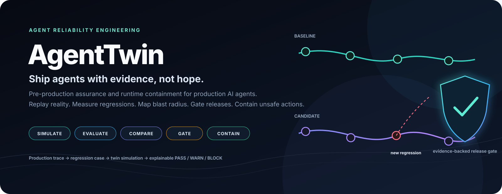
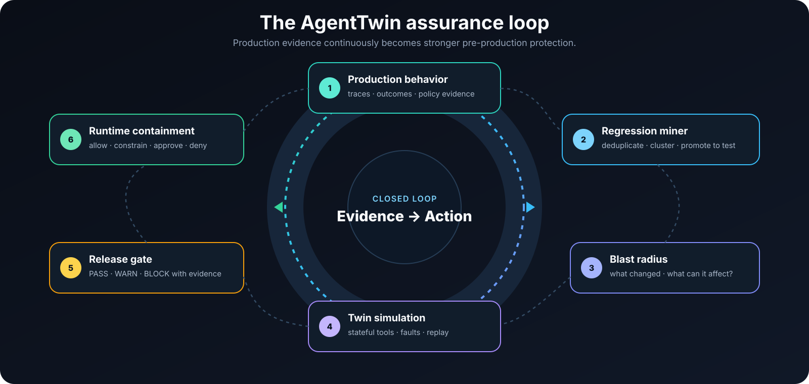
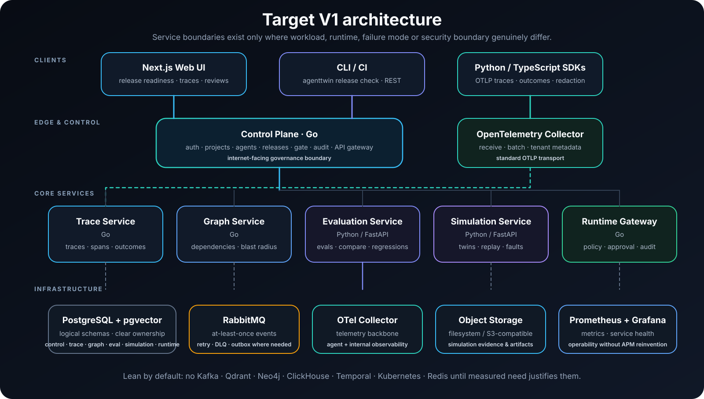
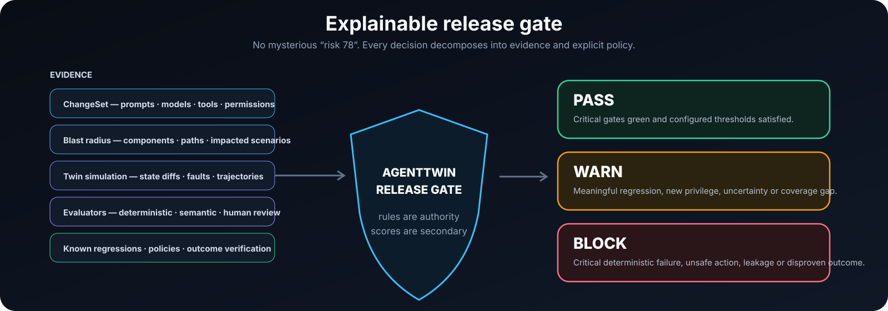

<div align="center">



<br/>


<br/><br/>

**Pre-production assurance and runtime containment for production AI agents.**

AgentTwin helps teams answer one question:

### **Can I safely ship this agent change — and what evidence supports that decision?**

<br/>

<table>
<tr>
<td align="center"><strong>REPLAY</strong><br/><sub>production-shaped behavior</sub></td>
<td align="center"><strong>COMPARE</strong><br/><sub>baseline vs candidate</sub></td>
<td align="center"><strong>MAP</strong><br/><sub>dependency blast radius</sub></td>
<td align="center"><strong>GATE</strong><br/><sub>PASS / WARN / BLOCK</sub></td>
<td align="center"><strong>CONTAIN</strong><br/><sub>unsafe runtime actions</sub></td>
</tr>
</table>

<p>
<a href="#why-agenttwin"><b>Why</b></a> ·
<a href="#the-assurance-loop"><b>Assurance Loop</b></a> ·
<a href="#what-makes-it-different"><b>Differentiation</b></a> ·
<a href="#architecture"><b>Architecture</b></a> ·
<a href="#release-gate"><b>Release Gate</b></a> ·
<a href="#development"><b>Development</b></a>
</p>

</div>

---

## Why AgentTwin

AI agents can technically **succeed while being wrong**.

A request may return `200 OK`, the agent may produce a confident final answer, and the run may still have:

- called the wrong tool;
- passed dangerous arguments;
- retried an irreversible action;
- skipped required approval;
- followed a malicious instruction hidden in retrieved content;
- looped and burned budget;
- claimed success although external state never changed;
- changed behavior after a prompt, model, tool or permission update.

Traditional observability tells you **what happened**. AgentTwin is designed to turn that evidence into a decision about **what is safe to ship next**.

> **Tracing is infrastructure. The product is the closed loop from real behavior to regression protection, simulation, release evidence and runtime containment.**

---

## The assurance loop

<div align="center">



</div>

The key workflow is deliberately circular:

```text
production behavior
      ↓
trace + verified outcome evidence
      ↓
failure / regression mining
      ↓
permanent regression case
      ↓
change detection + blast radius
      ↓
production-shaped twin simulation
      ↓
deterministic + semantic evaluation
      ↓
explainable release gate
      ↓
canary / production
      ↓
runtime containment
      └──────────────→ back to evidence
```

A bad production trace should not end as an incident note. It should become a **durable test that protects every future release**.

---

## What makes it different

<table>
<tr>
<td width="50%" valign="top">

### 🧬 Production failures become regression protection

AgentTwin can turn failed outcomes, policy violations, loops, unsafe retries and human-flagged traces into reviewed **regression cases** that automatically join future release checks.

</td>
<td width="50%" valign="top">

### 🪞 Production-shaped digital twins

Scenarios are more than prompts. They include initial state, tool twins, permissions, expected outcomes, fault rules and final-state assertions so agents are tested against **stateful reality**, not toy inputs.

</td>
</tr>
<tr>
<td width="50%" valign="top">

### 🕸️ Change-aware blast radius

A prompt, model, tool schema, policy or permission change is mapped to affected components, dependency paths, historical failures and relevant scenarios — with evidence for **why each test was selected**.

</td>
<td width="50%" valign="top">

### 🧭 Trajectory-aware evaluation

AgentTwin evaluates final outcome **and** the path taken: tool choice, arguments, ordering, retries, approvals, loops, side effects, latency, cost, policy decisions and verified final state.

</td>
</tr>
<tr>
<td width="50%" valign="top">

### 🚦 Explainable release gates

Release decisions are **PASS / WARN / BLOCK** with machine-readable evidence. One average score can never hide a new critical irreversible failure.

</td>
<td width="50%" valign="top">

### 🛡️ Runtime containment

The optional runtime gateway can allow, constrain, require approval or deny tool actions using explicit policy, idempotency and audit — especially for irreversible operations.

</td>
</tr>
</table>

---

## The questions AgentTwin asks before you ship

```text
WHAT CHANGED?
      ↓
WHAT CAN THAT CHANGE AFFECT?
      ↓
WHICH REAL BEHAVIORS SHOULD WE REPLAY?
      ↓
WHAT FAILS IN A SAFE TWIN?
      ↓
IS THIS CHANGE SAFE TO SHIP?
      ↓
WHAT SHOULD BE WATCHED OR CONTAINED AFTER RELEASE?
```

This is the product center of gravity — not token charts, prompt playgrounds or another generic trace viewer.

---

## Architecture

<div align="center">



</div>

AgentTwin uses microservices where there is a real difference in **workload, language/runtime, scaling, failure mode or security boundary** — not for microservice theatre.

| Service | Runtime | Responsibility |
| --- | --- | --- |
| **control-plane** | Go | auth, tenancy, projects, agents, releases, gate decisions, audit, API edge |
| **trace-service** | Go | OTLP ingestion, normalization, traces, spans, outcomes |
| **graph-service** | Go | components, dependency evidence, bounded blast-radius traversal |
| **evaluation-service** | Python / FastAPI | datasets, evaluators, comparisons, regression mining, embeddings, review |
| **simulation-service** | Python / FastAPI | scenarios, stateful tool twins, replay, fault injection, evidence |
| **runtime-gateway** | Go | policy decisions, approvals, idempotency, outbound safety, audit |

The V1 infrastructure stays intentionally lean:

**PostgreSQL + pgvector · RabbitMQ · OpenTelemetry Collector · S3-compatible object storage · Docker Compose**

Kafka, Qdrant, Neo4j, ClickHouse, Temporal, Kubernetes and Redis are **not default dependencies**. They only enter when measured scaling needs justify them.

Full architecture: [docs/architecture/system.md](docs/architecture/system.md)

---

## Release gate

<div align="center">



</div>

The gate is evidence-first. A secondary risk index may help sorting, but it is never the authority.

### BLOCK examples

Critical deterministic scenario failure · cross-tenant leakage · missing approval · duplicate irreversible side effect · authorization bypass · prompt-injection critical failure · a claimed success disproven by state verification.

### WARN examples

Meaningful latency or cost regression · new tool permission · new affected dependency without test coverage · evaluator uncertainty · insufficient simulation coverage.

### PASS

Critical gates are green and configured policy thresholds are satisfied.

---

## Core product surfaces

<table>
<tr>
<td width="33%" valign="top">

### Trace Explorer

Inspect trajectories, tool calls, model calls, policy decisions, retries, outcome verification and linked regressions.

</td>
<td width="33%" valign="top">

### Regression Miner

Redact, match, embed, group, classify and promote production failures into permanent tests.

</td>
<td width="33%" valign="top">

### Scenario Library

Versioned scenarios with state, tool twins, fault injection, evaluators, severity and reproducible seeds.

</td>
</tr>
<tr>
<td width="33%" valign="top">

### Blast Radius

Map changed components to impacted dependencies, scenarios, policies and historical failures.

</td>
<td width="33%" valign="top">

### Baseline vs Candidate

Replay identical initial states and surface improved, unchanged, regressed and new-critical-failure slices.

</td>
<td width="33%" valign="top">

### Runtime Gateway

Enforce action policy with `allow`, `allow_with_limits`, `require_approval` and `deny`.

</td>
</tr>
</table>

---

## Security by design

AgentTwin treats agent reliability and agent security as the same production problem.

- **Content capture is off by default.**
- Client-side redaction supports drop, mask and hash modes.
- Tenant identity comes from verified credentials — not agent-supplied span attributes.
- Irreversible runtime actions fail closed when policy evaluation fails.
- Approval tokens are single-use, short-lived and bound to the exact action hash.
- Simulation workers are designed for isolation and restricted egress.
- Remote tool descriptions and results are treated as untrusted input.
- Multi-tenant isolation, SSRF controls and prompt-injection suites are release-blocking concerns.
- Gate decisions and evidence are designed to be immutable and auditable.

Threat model: [docs/security/threat-model.md](docs/security/threat-model.md)

---

## Agent Assurance Coverage

Traditional line coverage does not describe agent safety.

AgentTwin is designed to measure coverage across:

| Coverage surface | Example question |
| --- | --- |
| **Tool coverage** | Did we exercise every tool the agent can call? |
| **Critical tool coverage** | Did we test every irreversible action? |
| **Policy coverage** | Did scenarios exercise active policies? |
| **Failure-mode coverage** | Which known failure classes were replayed? |
| **Regression coverage** | Did every promoted regression run again? |
| **Dependency coverage** | Are affected components represented in the suite? |
| **Fault coverage** | Did we test timeouts, 429/500/503, stale and duplicate responses? |
| **Outcome verification** | Did we verify business state instead of trusting agent self-report? |

AgentTwin does **not** turn these into a misleading “95% safe” claim.

---

## Development

> **AgentTwin is under active phased development.** Phases 0–6 are done; the
> runtime gateway and hardening follow.

Track live build status and the evidence of each phase: [docs/plan/implementation-board.md](docs/plan/implementation-board.md)

### What works today (Phases 1–6)

* **Trace ingestion** from any OpenTelemetry-instrumented agent through the
  OTel Collector into the trace service: GenAI semantic conventions, per-project
  content policy, idempotent ingest, deterministic trace summaries, claimed vs
  verified outcomes with contradiction detection.
* **Python SDK** ([`packages/sdk-python`](packages/sdk-python)) with client-side
  redaction, content capture off by default and measured overhead
  ([benchmarks](docs/benchmarks/sdk-overhead.md)); it also starts simulations,
  builds datasets and runs evaluations.
* **Control plane**: dev and OIDC authentication, organizations, projects,
  RBAC, API keys, immutable agent manifests and versions, hash-chained audit log.
* **Simulation**: versioned scenarios run against declarative, stateful tool
  twins with injected faults (timeout after mutation, a tool that lies about
  success, rate limits…); every case records its trajectory, the twin's state
  diff and a verdict per expectation; the same seed reproduces the verdicts.
* **Evaluation**: deterministic expectations (state, trajectory, policy,
  side effects) and semantic ones graded by a judge — a deterministic fake by
  default, Anthropic or any OpenAI-compatible model behind configuration
  (`JUDGE_PROVIDER`), with a spending budget and a verdict cache. An
  evaluation runs a baseline and a candidate version on one pinned suite and
  seed, and classifies every case: new critical failure, regressed,
  incomplete, improved or unchanged, with the first step where the two
  diverged. Versioned datasets, human reviews that replace a verdict, and
  judge calibration against labels people gave (agreement and Cohen's kappa).
* **Dependency graph and change impact**: the graph of each project is built
  from agent manifests, imported OpenAPI documents and MCP tool lists,
  production traffic, scenarios and manual mappings, and every relationship
  says how it is known (declared, observed or inferred) and how far to trust
  it. A change set compares two versions of an agent — prompt (with a masked
  diff), model, limits, tools and their input schemas, risk, retrieval
  sources, dependencies, code — and its impact lists the scenarios the
  change requires, each with why: linked by the graph through the changed
  component, close to what changed (text similarity by default; a hosted
  embedding model behind `EMBEDDING_PROVIDER`), always run by the gate
  policy, or a known production regression. An impact a service could not
  compute says so (`complete: false`) instead of listing fewer scenarios.
* **Release gate**: a release records a candidate version against its
  baseline; each evaluation is a revision that pins what it rests on — the
  gate policy, the change's impact, the suite at the scenario versions it
  selected, the tools — and runs both versions on it with the release's
  seed. The gate's deterministic rules decide **PASS / WARN / BLOCK** with
  the evidence of every rule that fired (the scenario, the candidate against
  the baseline, what was observed, the first divergence, the trace);
  missing evidence is BLOCK, never a pass. The decision is stored once with
  its input and their SHA-256, and every read says whether it still
  verifies. An override (owners, admins, and reviewers when the policy
  allows) records who, why, the ticket and until when, and never turns the
  decision into a PASS.
* **Regression mining**: failing production traces become candidates from
  deterministic signals (a failed or contradicted outcome, an irreversible
  action taken twice, a write retried without an idempotency key, a loop, a
  tool error, a policy denial, a timeout after a mutation, a person's flag).
  The miner keeps structured features, never the conversation. It groups the
  candidates by known fingerprint, else by nearest neighbour, and suggests a
  label and a severity, each with its evidence. A reviewer promotes a group
  into a regression test. The scenario is drafted from its representative
  trace: the input and request context, the faults it suffered, the
  expectations that catch the failure, and production entities mapped onto
  the twin's records. The test joins the `production-regressions` dataset,
  and every later release of the agent runs it as a known regression. A
  release blocks if the regression is back; a version that passes the test
  marks it fixed.
* **CLI** ([`packages/cli`](packages/cli)): `agenttwin release check` creates a
  release from CI, waits for its gate, prints why it decided and exits with
  it (0 pass, 2 warn, 3 block, 4 infrastructure error), with JUnit and JSON
  reports; `agenttwin agent register` registers a version from its manifest.
* **Web UI**: trace explorer and trace detail with waterfall; scenarios and
  simulations with the evidence down to the tool call and the state diff;
  evaluations, compared cases side by side, datasets, the review queue and
  judge calibration; change sets with what each change requires and why,
  and the dependency graph with a change's blast radius, evidence filters
  and manual mappings; releases with why each gate decided, its evidence
  and hash, the pinned suite, the audit trail, and overrides; the regression
  inbox, each group's evidence, failures and history, triage, merges and the
  promotion of its drafted scenario.
* **Demo**: *Demo Co*'s support-refund agent with production-like tools,
  driven by a deterministic scripted planner (or Anthropic Claude when
  `DEMO_AGENT_MODEL=anthropic` and a key are set). Version 1.2.4 is good,
  1.3.0 regresses (it refunds before checking the policy and trusts a tool's
  false success), 1.3.1 fixes it, and 1.3.2 changes only the refund tool's
  contract (`idempotency_key` becomes required). `make dev` seeds 9
  scenarios, simulations of 1.2.4 and 1.3.0, the `refund-regression-suite`
  dataset, an evaluation of 1.3.0 against 1.2.4 that finds the regression
  (two new critical failures and one regressed case), the payments and
  orders APIs (OpenAPI) and the support desk's MCP tools, and two change
  sets — the prompt change 1.2.4 → 1.3.0 and the tool change 1.3.1 → 1.3.2 —
  each listing the scenarios it requires and why, and two gated releases:
  1.2.4 → 1.3.0, **BLOCKED**, and its fix 1.2.4 → 1.3.1, which is not. It
  ends with a canary production incident on 1.3.0: a refund whose payment
  times out after the money moved and is retried without an idempotency key,
  so the customer is refunded twice. The miner groups it into the regression
  inbox, where a reviewer can promote it.

### Quick start (local)

Requirements: Docker with Compose 2.20+, `make`, `curl`.

```bash
git clone https://github.com/Ozgurisikdamar/AgentTwin.git
cd AgentTwin

cp .env.example .env
make dev        # builds and starts the stack, waits until healthy, seeds the demo workspace
```

Then open <http://localhost:3000> and sign in with a demo account
(development authentication):

| Account | Role |
|---|---|
| `owner@demo.agenttwin.dev` | owner |
| `admin@demo.agenttwin.dev` | admin |
| `engineer@demo.agenttwin.dev` | engineer |
| `reviewer@demo.agenttwin.dev` | reviewer |
| `viewer@demo.agenttwin.dev` | viewer |

Useful developer entrypoints:

```bash
make help
make demo       # one more refund conversation through the demo agent; prints the trace link
make doctor     # checks Docker, env, ports, PostgreSQL, RabbitMQ, OTel, migrations, services
make e2e        # Playwright tests against the running stack
make test       # unit + integration (real PostgreSQL + RabbitMQ) + frontend tests
make lint       # formatters, linters and type checkers for Go, Python and TypeScript
make down       # stop (keeps data) · make reset: wipe data and start again
```

Gate a release from the command line (or CI) against the local stack:

```bash
make cli        # builds bin/agenttwin
set -a; . ./.env; set +a
AGENTTWIN_API_KEY=$AGENTTWIN_DEMO_API_KEY AGENTTWIN_WEB_URL=http://localhost:3000 \
  bin/agenttwin release check --project support \
    --baseline support-refund-agent@1.2.4 --candidate support-refund-agent@1.3.0 --ci
echo $?         # 3: blocked, with the rules and evidence printed above
```

See [`packages/cli/README.md`](packages/cli/README.md) for the flags, the
reports and a GitHub Actions step.

Instrument your own agent with the Python SDK: see
[`packages/sdk-python/README.md`](packages/sdk-python/README.md). Point
`AGENTTWIN_OTLP_ENDPOINT` at `http://localhost:4318` and use the demo project
key from `.env` (`AGENTTWIN_DEMO_API_KEY`).

---

## Repository map

```text
apps/
  web/                Next.js UI and its BFF (/api/v1 through the control plane)

services/
  control-plane/      Go · auth, tenancy, projects, agents, tool imports, change sets, releases and gates, audit, API edge
  trace-service/      Go · OTLP ingestion, traces, outcomes
  graph-service/      Go · dependency graph, evidence, bounded blast radius
  simulation-service/ Python · scenarios, tool twins, faults, simulation runs
  evaluation-service/ Python · datasets, evaluation runs, judges, reviews, regression mining

packages/
  contracts/          shared versioned event schemas and OpenAPI documents
  gokit/              shared Go infrastructure primitives
  core-py/            shared Python kit (service runtime, jobs, evaluators, contract checks)
  sdk-python/         Python SDK
  cli/                the agenttwin CLI (release check for CI, agents, doctor)
  scenario-schema/    versioned scenario, twin, manifest and policy schemas

demo/
  support-refund-agent/  Demo Co's refund agent, its tools, manifests and scenarios

docs/
  architecture/       system architecture and domain references
  adr/                architectural decision records
  plan/               phased implementation board
  security/           threat model and security design

infra/
  otel/               OpenTelemetry collector configuration
  prometheus/         metrics collection
  grafana/            local observability provisioning
```

The runtime gateway and the TypeScript SDK join as their phases land.

---

## Design principles

1. **Deterministic where possible.** Use an LLM only when semantic reasoning genuinely adds value.
2. **Evaluate trajectories, not only final text.**
3. **Outcome evidence beats agent self-report.**
4. **Production failures become future tests.**
5. **Simulation should resemble deployment.**
6. **Blast radius is probability × possible damage.**
7. **Human approval is selective, not universal.**
8. **Every release decision must be explainable.**
9. **No bespoke ML model until reviewed data justifies it.**
10. **No infrastructure component without a measured reason to exist.**

---

## Documentation

| Document | Purpose |
| --- | --- |
| [System Architecture](docs/architecture/system.md) | C4-style architecture, request paths, data ownership and events |
| [Implementation Board](docs/plan/implementation-board.md) | Build phases and acceptance criteria |
| [Architecture Decisions](docs/adr/) | Why the system is built this way |
| [Threat Model](docs/security/threat-model.md) | Security boundaries and abuse cases |
| [Shared Contracts](packages/contracts/README.md) | Versioned internal event and contract definitions |

---

## License

Apache License 2.0 — see [LICENSE](LICENSE).

<br/>

<div align="center">

### **Ship agents with evidence, not hope.**

<sub>AgentTwin · Simulation · Regression Mining · Blast Radius · Release Assurance · Runtime Containment</sub>

</div>
