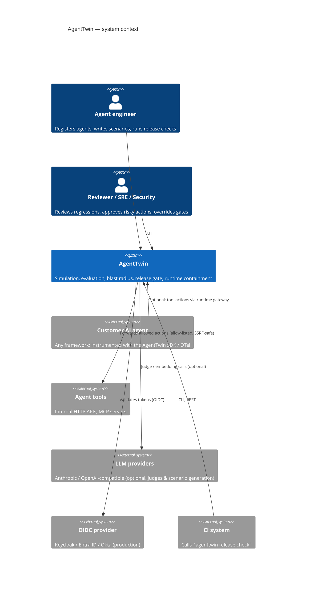
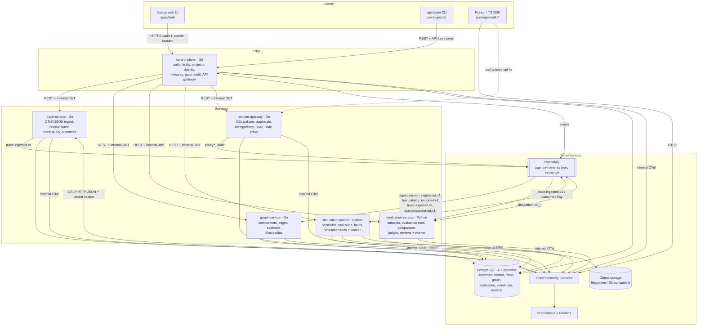
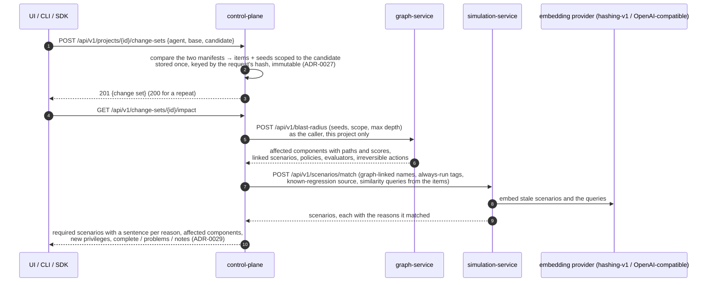

# AgentTwin — System Architecture

> Working name in the original specification: *AegisTwin*. The repository already
> carried the name **AgentTwin**; per the specification's own rule (§6 "If the
> repository already has a name, preserve it") the product is called AgentTwin
> everywhere. See [ADR-0000](../adr/0000-product-name.md).

AgentTwin answers one question for teams that operate tool-using AI agents:

> **Can I safely ship this agent change, and what evidence supports that decision?**

It closes the loop between production behavior and release decisions:

```text
production trace ──► outcome evidence ──► regression mining ──► permanent regression case
        ▲                                                                │
        │                                                                ▼
runtime containment ◄── canary/prod ◄── explainable release gate ◄── change detection
(policy + approvals)                        ▲                            │
                                            │                            ▼
                         deterministic + semantic eval ◄── production-shaped simulation
                                                          ◄── dependency / blast radius
```

## 1. C4 — System context



## 2. C4 — Containers



### 2.1 Why these service boundaries

Service boundaries exist only where workload, runtime, failure mode or security
boundary genuinely differ (specification §7 — "no microservice theatre"):

| Service | Language | Justification for a separate process |
|---|---|---|
| control-plane | Go | The only internet-facing edge: authentication, RBAC, tenancy, audit. Governance data with strict transactional invariants. |
| trace-service | Go | Ingestion workload scales with customer traffic, not with users. Must survive bursts and back-pressure independently. |
| graph-service | Go | Bounded recursive traversal and evidence bookkeeping; consumes events from several producers. |
| evaluation-service | Python | Evaluators, embeddings, clustering (numpy, scikit-learn) and LLM-judge adapters live in the Python ecosystem. Worker process is separable from its API (a slow judge never blocks it). |
| simulation-service | Python | Long-running CPU/IO jobs with isolated per-run state; different failure mode (a stuck simulation must not affect the API). Worker process is separable from its API. |
| runtime-gateway | Go | Sits in the agent's hot path for tool actions; latency-sensitive, security boundary for outbound traffic. |

Everything else — policies stored with the gateway, gate rules in the control
plane, the CLI as a thin REST client — deliberately does **not** get its own
process.

## 3. Request paths

### 3.1 Public API (UI and CLI)

1. The browser never holds a bearer token. The Next.js server stores the session
   token in an `HttpOnly; SameSite=Lax` cookie (`Secure` behind HTTPS) and
   proxies `/api/v1/*` to the control-plane (BFF pattern). The BFF rejects
   cross-site writes (`Sec-Fetch-Site`, falling back to `Origin` vs `Host`),
   refuses path traversal, caps request bodies at 16 MiB, clears the cookie when
   the control-plane answers 401, and never forwards cookies upstream. Pages are
   served with a per-request nonce Content-Security-Policy (`script-src 'self'
   'nonce-…' 'strict-dynamic'`, `frame-ancestors 'none'`).
2. The control-plane authenticates (dev session JWT, OIDC token, or project API
   key), resolves the principal `{organization, role, project scope}` and applies
   RBAC.
3. Requests owned by another service are forwarded with a short-lived (60 s)
   **internal JWT** (`aud` = target service) carrying `org`, `projects`, `role`,
   `actor` and `request_id`. Downstream services verify the token **and** scope
   every SQL query by organization (defense in depth: a bug in the edge must not
   leak tenants). For a person, who may act in every project of the
   organization, `projects` lists them, read fresh on each request. A service
   cannot tell which organization a project id belongs to, and "all projects"
   would let another organization's project id through (ADR-0025).

### 3.2 Telemetry ingestion

`SDK --OTLP--> Collector --OTLP/HTTP(JSON)--> trace-service /v1/traces`

The SDK sends the project API key in the `x-agenttwin-api-key` header. The
collector keeps it as request metadata (`include_metadata`), batches **per key**
(`batch.metadata_keys`) so tenants are never merged into one export, and the
`headers_setter` extension re-attaches it on export. trace-service verifies the
key with the control-plane (`/internal/v1/api-keys/verify`, internal JWT) and
caches the answer for 30 s (`API_KEY_CACHE_TTL`; rejections for 10 s, transient
lookup failures not at all), so a revoked key stops working within 30 s.
Tenancy and content policy are derived from the verified key, never from span
attributes supplied by the agent.

#### Trace lifecycle

1. **Ingest** (`POST /v1/traces`): OTLP/JSON or protobuf, gzip allowed, bounded
   body and decompressed size, bounded concurrency (`INGEST_MAX_CONCURRENT`,
   excess → 503 so the collector retries). Spans are normalized (GenAI semantic
   conventions + `agenttwin.*` attributes), hostile values are truncated and
   out-of-vocabulary enums normalized, content is filtered again by the
   project's content mode, and spans are upserted idempotently (a collector
   retry never duplicates a span). The trace row is marked `dirty`.
2. **Finalize** (background, every replica): a dirty trace is finalized once its
   root span arrived and no span came for `TRACE_SETTLE_DURATION` (2 s), or after
   `TRACE_INCOMPLETE_AFTER` (2 min) without a root (`incomplete` signal). The
   finalizer claims rows with `FOR UPDATE SKIP LOCKED`, computes the
   deterministic summary (tool sequence, errors, retries, cost, last good step,
   failing tool, signals), records the span-reported outcome and writes
   `trace.ingested.v1` (and `trace.outcome_recorded.v1`) to the outbox in the
   same transaction. A trace that keeps failing is retried at most 10 times and
   never blocks other traces; new spans reset its budget.
3. **Outcomes** reported later through the API (`POST
   /api/v1/traces/{id}/outcome`) take precedence over the agent's self-report
   and flag contradictions (claimed success, verified failure).
4. **Query**: explorer list with keyset pagination and filters, facets (value
   counts over the most recent 10,000 traces), detail, and stats — all scoped by
   organization and project in SQL.

### 3.3 Release evaluation (asynchronous)

A release is a candidate version of an agent recorded against its baseline,
with the change set between them (§3.7). Each evaluation of it is a
**revision** that records what it rests on and is decided once
([ADR-0031](../adr/0031-a-release-evaluation-is-a-revision-and-its-decision-is-hashed-evidence.md)).

```mermaid
sequenceDiagram
  autonumber
  participant U as UI / CLI
  participant CP as control-plane
  participant GS as graph-service
  participant SS as simulation-service
  participant ES as evaluation-service
  participant MQ as RabbitMQ
  U->>CP: POST /releases (Idempotency-Key) or POST /releases/{id}/evaluate
  CP->>GS: POST /api/v1/blast-radius (the change set's seeds)
  GS-->>CP: affected components, paths, linked scenarios
  CP->>SS: POST /api/v1/scenarios/match (names, tags, similarity queries)
  SS-->>CP: scenarios + selection reasons, each at a scenario version
  CP->>CP: one tx: release_evaluation (revision n: policy, impact, pinned suite, tools, seed) + outbox(evaluation.run_requested.v1)
  CP-->>U: 202 gate {status: EVALUATING, effective_outcome: PENDING}
  CP->>MQ: evaluation.run_requested.v1 (outbox relay, publisher confirms)
  MQ->>ES: consume → create EvalRun for the release evaluation (idempotent)
  ES->>SS: POST /internal/v1/simulation-pairs (baseline + candidate, the pinned scenario versions, the release's seed)
  SS->>MQ: simulation.run_requested.v1 → a worker runs both sides in isolated twins
  SS->>MQ: simulation.run_completed.v1
  MQ->>ES: both sides done → expectations, comparison, first divergence
  ES->>MQ: evaluation.run_completed.v1 (release_evaluation_id)
  MQ->>CP: read the run and its cases → gate rules → gate_decision {input, decision, sha256(input, decision)}
  U->>CP: GET /releases/{id}/gate (the CLI polls; the UI refreshes while PENDING)
```

The gate's rules are pure and deterministic (`internal/gate`, ADR-0007): the
same input always yields the same outcome, rules and risk index. The decision
is stored with the input it rests on and the SHA-256 of both; the database
refuses to change a release, an evaluation's input or a decision (§6), and
every read of the gate says whether the stored decision still hashes to its
recorded value (`evidence_verified`).

**Never a silent pass.** A mandatory scenario without a result, a scenario
the library could not pin, a failed or cancelled run, an impact that is not
`complete` or an evaluation service that does not know the run: each is
**BLOCK (incomplete)**. A suite with nothing to run is decided at once: an
empty suite is a coverage warning, a suite no scenario of which could be
pinned is missing evidence.

**Overrides** are separate, immutable records (spec §92): who, why, the
ticket, until when (≤ 90 days). The decision keeps its outcome; the gate
reports `effective_outcome: OVERRIDDEN` next to `decision.outcome` and the
original outcome, and only the latest revision's WARN or BLOCK can be
overridden, once. Reviewers override only when the project's gate policy
allows it.

**In CI** the `agenttwin` CLI (`packages/cli`) creates the release with an
`Idempotency-Key` derived from the request (a retried job does not create a
second release), polls the gate, prints why it decided and exits with it:
`0` PASS or overridden, `2` WARN (with `--ci`, only when the policy fails CI
on warnings), `3` BLOCK, `4` an infrastructure or configuration error.

### 3.4 Simulation run

```mermaid
sequenceDiagram
  autonumber
  participant U as UI / CLI / SDK
  participant CP as control-plane
  participant SS as simulation-service
  participant W as simulation worker
  participant A as agent under test
  participant TS as trace-service
  U->>CP: POST /api/v1/simulations (Idempotency-Key)
  CP->>SS: forward with an internal JWT
  SS->>SS: scenarios checked against their twins, versions and seeds pinned,<br/>run + cases + outbox(simulation.run_requested.v1) in one tx
  SS-->>U: 202 {run, cases}
  SS->>W: event wakes a worker (or the next poll finds the run)
  W->>W: claim run (FOR UPDATE SKIP LOCKED, renewable lease)
  loop every case
    W->>W: fresh twin state + per-case capability token
    W->>A: POST /run (input, twin URL, token, run context)
    A->>SS: POST /twin/v1/tools/{tool} (token)
    SS-->>A: reply (faults applied); the twin records the call
    A-->>W: final answer + claimed outcome
    W->>W: revoke token, evaluate expectations on the recorded state → verdict
  end
  W->>SS: run COMPLETED + outbox(simulation.run_completed.v1)
  W->>TS: verified outcome on each case's trace (retried until ingested)
```

Design decisions: [ADR-0016](../adr/0016-declarative-tool-twins-and-faults.md)
(twins and faults), [ADR-0017](../adr/0017-simulation-runs-cancellation-and-verdicts.md)
(runs, cancellation, verdicts), [ADR-0019](../adr/0019-idempotency-keys-per-user-action.md)
(idempotency), [ADR-0020](../adr/0020-scenario-documents-stored-as-data.md)
(scenario documents).

### 3.5 Evaluation run

The comparison the release gate will rely on, available on its own since
Phase 3 (UI, SDK, `make seed`):

```mermaid
sequenceDiagram
  autonumber
  participant U as UI / SDK
  participant CP as control-plane
  participant ES as evaluation-service
  participant W as evaluation worker
  participant SS as simulation-service
  participant J as judge (fake / Anthropic / OpenAI-compatible)
  participant MQ as RabbitMQ
  U->>CP: POST /api/v1/eval-runs (Idempotency-Key)
  CP->>ES: forward with an internal JWT
  ES->>ES: dataset version (or the scenarios asked for) resolved,<br/>run QUEUED + transition + audit in one tx
  ES-->>U: 202 {run}
  W->>W: claim (FOR UPDATE SKIP LOCKED, lease) → PREPARING
  W->>SS: POST /internal/v1/simulation-pairs (keyed by the eval run)
  SS-->>W: baseline + candidate runs, one pinned suite and seed<br/>(versions and scenarios checked here; a refusal fails the run)
  W->>W: RUNNING: lease released, next check + wait deadline set
  SS->>MQ: simulation.run_completed.v1 (each side)
  MQ->>ES: the run is due now (polling is the fallback)
  W->>W: both sides done → claim → EVALUATING
  W->>SS: read every case of both sides
  W->>J: grade semantic expectations (budget, verdict cache)
  W->>W: classify each case, first divergence, deltas, slices
  W->>ES: case results + COMPLETED + outbox(evaluation.run_completed.v1) in one tx
```

A person can then review one expectation's verdict: the review replaces it,
and the case and the run are classified again from the stored snapshots,
without the simulation service. Design decisions:
[ADR-0022](../adr/0022-judges-grade-semantic-expectations.md) (judges),
[ADR-0023](../adr/0023-baseline-and-candidate-run-as-one-pinned-pair.md)
(the pinned pair), [ADR-0024](../adr/0024-evaluation-runs-wait-without-a-lease.md)
(waiting without a lease).

### 3.6 The dependency graph (from events)

The graph service builds each project's graph from events, and people add
manual mappings (ADR-0026):

| Event (producer) | Components and relationships | Evidence |
|---|---|---|
| `agent.version_registered.v1` (control plane) | agent, version (`VERSION_OF`), prompt, model, tools (`USES`), retrieval sources, declared dependencies of each tool | `MANIFEST` |
| `tool.catalog_imported.v1` (control plane, ADR-0028) | tool → `HTTP_API` or `MCP_SERVER` → `SERVICE` | `OPENAPI` (0.9), `MCP` (0.8) |
| `trace.ingested.v1` (trace service; production traffic only, not simulations or tests) | version `USES` the tools it called, a tool `CALLS` the host it reached; counted, not stored per trace | `OBSERVED` |
| `scenario.upserted.v1` (simulation service) | scenario, `TESTED_BY` from the agent and the components it covers | `SCENARIO` |
| `policy.activated.v1` (runtime gateway, Phase 7) | policy, the tool it targets `GUARDED_BY` it | `MANUAL` (the policy author's) |
| `PUT /api/v1/graph/mappings/{tool}` (a person, `graph.write`, audited) | tool → dependencies | `MANUAL` |

Every relationship keeps one evidence row per source and reference; the
edge's sources and confidence follow from them. Writes to one project are
serialized (advisory lock) and idempotent per event (`processed_event`); an
event that cannot be mapped is parked, not retried.

### 3.7 Change impact

What a change requires, available on its own since Phase 4 (UI, SDK, and
`make seed`, which compares the pairs in `SEED_CHANGES`), and the input of
the release gate (Phase 5):



A service that cannot answer makes the impact `complete: false` with the
problem named; it never shrinks the suite silently. The web shows the change
set, the diff of each item, the required scenarios with why, and the blast
radius on the dependency graph (ADR-0030).

### 3.8 Runtime containment (opt-in)

`agent → POST /gateway/v1/tools/{tool}/invoke → policy (CEL) → allow | allow_with_limits | require_approval | deny → upstream tool`

Approval tokens are single-use, short-lived and bound to the SHA-256 hash of the
exact canonical action (tool, arguments, agent, project). Changing any argument
invalidates the approval.

## 4. Data ownership

One PostgreSQL cluster, one logical schema per service. A service writes only to
its own schema and never reads another service's tables; cross-service data flows
through REST (synchronous, owner-validated) or events (asynchronous).

| Schema | Owner | Main tables |
|---|---|---|
| `control` | control-plane | organization, app_user, membership, project, environment, api_key, agent, agent_version, prompt_version, tool, tool_version, tool_catalog, change_set, release, release_evaluation, gate_decision, gate_override, audit_event, idempotency_record, outbox, processed_event (the gate policy is a column of `project`) |
| `trace` | trace-service | trace, span, outcome, trace_flag, outbox |
| `graph` | graph-service | component, dependency_edge, edge_evidence, outbox, processed_event |
| `evaluation` | evaluation-service | dataset, dataset_version, eval_run, eval_run_transition, eval_case_result, judgment (verdict cache), human_review, judge_calibration, outbox, processed_event (regression mining adds its tables in Phase 6) |
| `simulation` | simulation-service | twin_definition, scenario, scenario_version, scenario_embedding (pgvector), simulation_run, simulation_run_transition, simulation_case, simulation_step, outbox, processed_event |
| `runtime` | runtime-gateway | policy, policy_version, policy_decision, approval_request, approval_token, idempotency_record, tool_endpoint, trace_tool_counter, outbox |

Each service ships its own versioned migrations (`<service>/migrations`), applied
automatically on local startup (`MIGRATE_ON_START=true`) and explicitly in
production (`<binary> migrate`). The migration ledger lives in
`<schema>.schema_migrations`.

## 5. Events and API contracts

Topic exchange `agenttwin.events`, envelope defined in
[`packages/contracts/events/envelope.v1.schema.json`](../../packages/contracts/events/envelope.v1.schema.json).
The complete catalog (producer → consumers) is in
[`packages/contracts/README.md`](../../packages/contracts/README.md).

Delivery semantics: at-least-once, publisher confirms, idempotent consumers
(`processed_event` table keyed by `(consumer, event_id)` inside the handling
transaction), bounded retry through a TTL retry queue, then a parking DLQ.
Events whose loss would corrupt state (audit, run requests, run completions)
are written through a **transactional outbox**.

HTTP APIs are documented by hand-written OpenAPI 3.1 documents in
[`packages/contracts/openapi`](../../packages/contracts/openapi), held to the
services by route parity, strict traffic checks in the integration tests and a
compatibility baseline ([ADR-0021](../adr/0021-http-contracts-checked-openapi.md)).

## 6. Key cross-cutting mechanisms

* **Content capture is off by default.** SDKs redact client-side before export
  (`drop`, `mask`, `hash` modes; email, phone, JWT, API-key, card, custom regex,
  JSON-path rules). The trace-service enforces the project's content mode again
  (it never stores more than the project allows, whatever the SDK sent),
  truncates oversized attributes and records that it did. Content is stored
  apart from span metadata with its own, shorter retention.
* **Hashing.** SHA-256 of canonical JSON identifies prompts, manifests, tool
  schemas, scenario versions, policies, evaluator configs and release evidence.
* **Immutability.** Gate decisions and their evidence snapshots are append-only
  (enforced by a database trigger). Re-evaluation creates a new revision.
* **Fail-safe.** Missing/erroring mandatory evaluation → BLOCK (INCOMPLETE).
  Irreversible runtime actions fail closed when policy evaluation fails.
* **Deterministic fakes are labeled.** The demo agent's scripted planner and the
  fake judge are marked `deterministic-fake` in every run record and in the UI.

## 7. Deployment

Local: `make dev` → Docker Compose (PostgreSQL+pgvector, RabbitMQ, OTel
Collector, Prometheus, Grafana, six services, simulation worker, web, demo
agent + demo tools). Production: the same images behind any container
orchestrator; see [`docs/production-deployment.md`](../production-deployment.md).

## 8. Explicit non-goals for V1

Kafka, Qdrant, Neo4j, ClickHouse, Elasticsearch, Temporal, Kubernetes/Helm,
Redis, service mesh, event sourcing, CQRS frameworks, a custom agent framework,
GNN-based impact prediction, trained risk models. Each has a documented upgrade
trigger in the ADRs.
