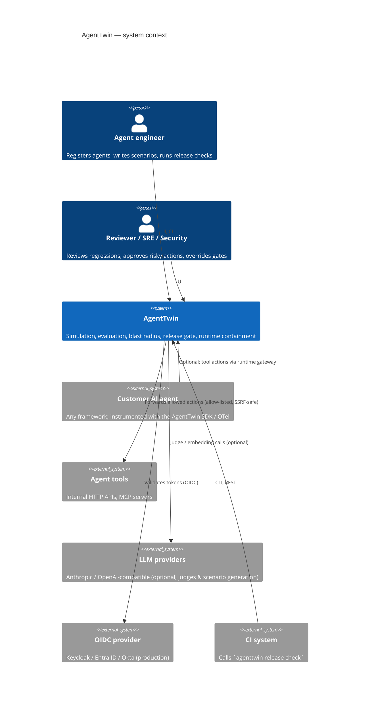
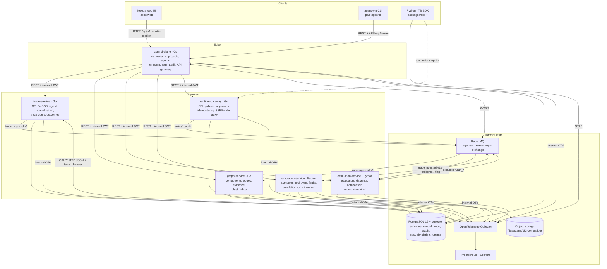
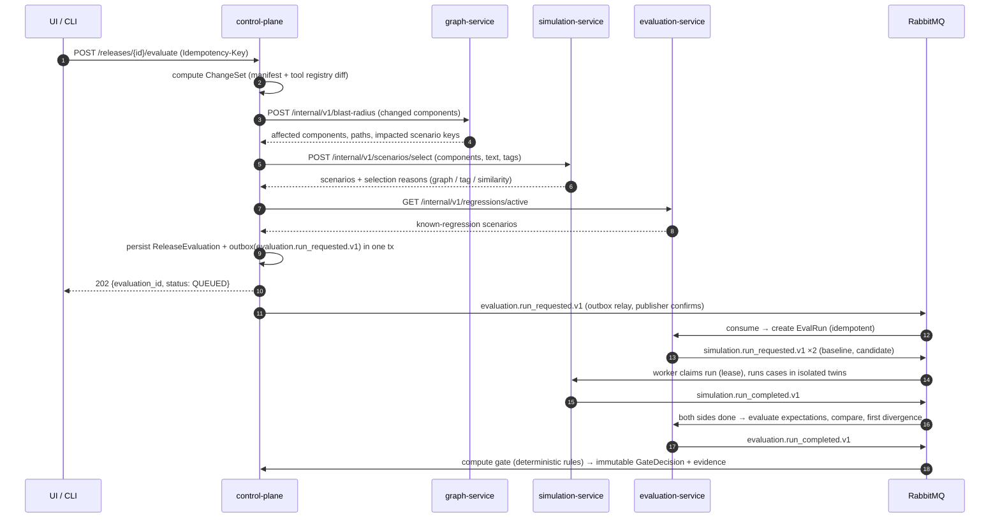

# AgentTwin — System Architecture

> Working name in the original specification: *AegisTwin*. The repository already
> carried the name **AgentTwin**; per the specification's own rule (§6 "If the
> repository already has a name, preserve it") the product is called AgentTwin
> everywhere. See [ADR-0000](../adr/0000-product-name.md).

AgentTwin answers one question for teams that operate tool-using AI agents:

> **Can I safely ship this agent change, and what evidence supports that decision?**

It closes the loop between production behavior and release decisions:

```text
production trace ──► outcome evidence ──► regression mining ──► permanent regression case
        ▲                                                                │
        │                                                                ▼
runtime containment ◄── canary/prod ◄── explainable release gate ◄── change detection
(policy + approvals)                        ▲                            │
                                            │                            ▼
                         deterministic + semantic eval ◄── production-shaped simulation
                                                          ◄── dependency / blast radius
```

## 1. C4 — System context



## 2. C4 — Containers



### 2.1 Why these service boundaries

Service boundaries exist only where workload, runtime, failure mode or security
boundary genuinely differ (specification §7 — "no microservice theatre"):

| Service | Language | Justification for a separate process |
|---|---|---|
| control-plane | Go | The only internet-facing edge: authentication, RBAC, tenancy, audit. Governance data with strict transactional invariants. |
| trace-service | Go | Ingestion workload scales with customer traffic, not with users. Must survive bursts and back-pressure independently. |
| graph-service | Go | Bounded recursive traversal and evidence bookkeeping; consumes events from several producers. |
| evaluation-service | Python | Evaluators, embeddings, clustering (numpy, scikit-learn) and LLM-judge adapters live in the Python ecosystem. |
| simulation-service | Python | Long-running CPU/IO jobs with isolated per-run state; different failure mode (a stuck simulation must not affect the API). Worker process is separable from its API. |
| runtime-gateway | Go | Sits in the agent's hot path for tool actions; latency-sensitive, security boundary for outbound traffic. |

Everything else — policies stored with the gateway, gate rules in the control
plane, the CLI as a thin REST client — deliberately does **not** get its own
process.

## 3. Request paths

### 3.1 Public API (UI and CLI)

1. The browser never holds a bearer token. The Next.js server stores the session
   token in an `HttpOnly; SameSite=Lax` cookie (`Secure` behind HTTPS) and
   proxies `/api/v1/*` to the control-plane (BFF pattern). The BFF rejects
   cross-site writes (`Sec-Fetch-Site`, falling back to `Origin` vs `Host`),
   refuses path traversal, caps request bodies at 16 MiB, clears the cookie when
   the control-plane answers 401, and never forwards cookies upstream. Pages are
   served with a per-request nonce Content-Security-Policy (`script-src 'self'
   'nonce-…' 'strict-dynamic'`, `frame-ancestors 'none'`).
2. The control-plane authenticates (dev session JWT, OIDC token, or project API
   key), resolves the principal `{organization, role, project scope}` and applies
   RBAC.
3. Requests owned by another service are forwarded with a short-lived (60 s)
   **internal JWT** (`aud` = target service) carrying `org`, `projects`, `role`,
   `actor` and `request_id`. Downstream services verify the token **and** scope
   every SQL query by organization (defense in depth: a bug in the edge must not
   leak tenants).

### 3.2 Telemetry ingestion

`SDK --OTLP--> Collector --OTLP/HTTP(JSON)--> trace-service /v1/traces`

The SDK sends the project API key in the `x-agenttwin-api-key` header. The
collector keeps it as request metadata (`include_metadata`), batches **per key**
(`batch.metadata_keys`) so tenants are never merged into one export, and the
`headers_setter` extension re-attaches it on export. trace-service verifies the
key with the control-plane (`/internal/v1/api-keys/verify`, internal JWT) and
caches the answer for 30 s (`API_KEY_CACHE_TTL`; rejections for 10 s, transient
lookup failures not at all), so a revoked key stops working within 30 s.
Tenancy and content policy are derived from the verified key, never from span
attributes supplied by the agent.

#### Trace lifecycle

1. **Ingest** (`POST /v1/traces`): OTLP/JSON or protobuf, gzip allowed, bounded
   body and decompressed size, bounded concurrency (`INGEST_MAX_CONCURRENT`,
   excess → 503 so the collector retries). Spans are normalized (GenAI semantic
   conventions + `agenttwin.*` attributes), hostile values are truncated and
   out-of-vocabulary enums normalized, content is filtered again by the
   project's content mode, and spans are upserted idempotently (a collector
   retry never duplicates a span). The trace row is marked `dirty`.
2. **Finalize** (background, every replica): a dirty trace is finalized once its
   root span arrived and no span came for `TRACE_SETTLE_DURATION` (2 s), or after
   `TRACE_INCOMPLETE_AFTER` (2 min) without a root (`incomplete` signal). The
   finalizer claims rows with `FOR UPDATE SKIP LOCKED`, computes the
   deterministic summary (tool sequence, errors, retries, cost, last good step,
   failing tool, signals), records the span-reported outcome and writes
   `trace.ingested.v1` (and `trace.outcome_recorded.v1`) to the outbox in the
   same transaction. A trace that keeps failing is retried at most 10 times and
   never blocks other traces; new spans reset its budget.
3. **Outcomes** reported later through the API (`POST
   /api/v1/traces/{id}/outcome`) take precedence over the agent's self-report
   and flag contradictions (claimed success, verified failure).
4. **Query**: explorer list with keyset pagination and filters, facets (value
   counts over the most recent 10,000 traces), detail, and stats — all scoped by
   organization and project in SQL.

### 3.3 Release evaluation (asynchronous)



Any missing mandatory result, failed simulation, evaluator `ERROR` or stale run
produces **BLOCK (INCOMPLETE)** — infrastructure uncertainty never yields PASS.

### 3.4 Runtime containment (opt-in)

`agent → POST /gateway/v1/tools/{tool}/invoke → policy (CEL) → allow | allow_with_limits | require_approval | deny → upstream tool`

Approval tokens are single-use, short-lived and bound to the SHA-256 hash of the
exact canonical action (tool, arguments, agent, project). Changing any argument
invalidates the approval.

## 4. Data ownership

One PostgreSQL cluster, one logical schema per service. A service writes only to
its own schema and never reads another service's tables; cross-service data flows
through REST (synchronous, owner-validated) or events (asynchronous).

| Schema | Owner | Main tables |
|---|---|---|
| `control` | control-plane | organization, app_user, membership, project, environment, api_key, agent, agent_version, prompt_version, tool, tool_version, release_candidate, release_evaluation, gate_decision, gate_override, gate_policy, audit_event, outbox, processed_event |
| `trace` | trace-service | trace, span, outcome, trace_flag, outbox |
| `graph` | graph-service | component, dependency_edge, edge_evidence, processed_event |
| `eval` | evaluation-service | dataset, eval_case, evaluator_version, eval_run, eval_result, scenario_comparison, human_review, failure, failure_cluster, regression_case, judge_calibration, outbox, processed_event |
| `simulation` | simulation-service | twin_definition, scenario, scenario_version, simulation_run, simulation_case, simulation_step, artifact, outbox, processed_event |
| `runtime` | runtime-gateway | policy, policy_version, policy_decision, approval_request, approval_token, idempotency_record, tool_endpoint, trace_tool_counter, outbox |

Each service ships its own versioned migrations (`<service>/migrations`), applied
automatically on local startup (`MIGRATE_ON_START=true`) and explicitly in
production (`<binary> migrate`). The migration ledger lives in
`<schema>.schema_migrations`.

## 5. Events

Topic exchange `agenttwin.events`, envelope defined in
[`packages/contracts/events/envelope.v1.schema.json`](../../packages/contracts/events/envelope.v1.schema.json).
The complete catalog (producer → consumers) is in
[`packages/contracts/README.md`](../../packages/contracts/README.md).

Delivery semantics: at-least-once, publisher confirms, idempotent consumers
(`processed_event` table keyed by `(consumer, event_id)` inside the handling
transaction), bounded retry through a TTL retry queue, then a parking DLQ.
Events whose loss would corrupt state (audit, run requests, run completions)
are written through a **transactional outbox**.

## 6. Key cross-cutting mechanisms

* **Content capture is off by default.** SDKs redact client-side before export
  (`drop`, `mask`, `hash` modes; email, phone, JWT, API-key, card, custom regex,
  JSON-path rules). The trace-service enforces the project's content mode again
  (it never stores more than the project allows, whatever the SDK sent),
  truncates oversized attributes and records that it did. Content is stored
  apart from span metadata with its own, shorter retention.
* **Hashing.** SHA-256 of canonical JSON identifies prompts, manifests, tool
  schemas, scenario versions, policies, evaluator configs and release evidence.
* **Immutability.** Gate decisions and their evidence snapshots are append-only
  (enforced by a database trigger). Re-evaluation creates a new revision.
* **Fail-safe.** Missing/erroring mandatory evaluation → BLOCK (INCOMPLETE).
  Irreversible runtime actions fail closed when policy evaluation fails.
* **Deterministic fakes are labeled.** The demo agent's scripted planner and the
  fake judge are marked `deterministic-fake` in every run record and in the UI.

## 7. Deployment

Local: `make dev` → Docker Compose (PostgreSQL+pgvector, RabbitMQ, OTel
Collector, Prometheus, Grafana, six services, simulation worker, web, demo
agent + demo tools). Production: the same images behind any container
orchestrator; see [`docs/production-deployment.md`](../production-deployment.md).

## 8. Explicit non-goals for V1

Kafka, Qdrant, Neo4j, ClickHouse, Elasticsearch, Temporal, Kubernetes/Helm,
Redis, service mesh, event sourcing, CQRS frameworks, a custom agent framework,
GNN-based impact prediction, trained risk models. Each has a documented upgrade
trigger in the ADRs.
